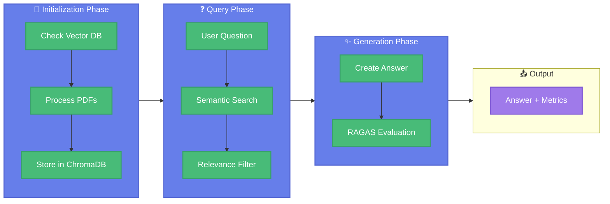
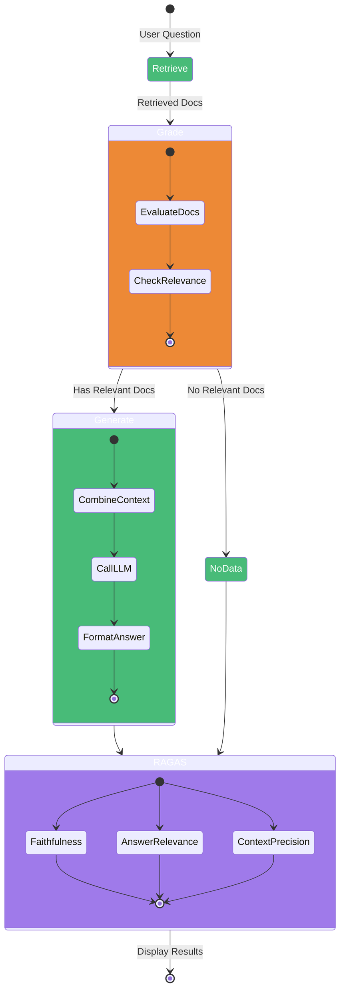
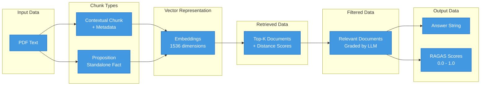

# Agentic RAG Architecture

## System Architecture Diagram

```mermaid
graph TB
    %% Define styles with attractive colors
    classDef inputStyle fill:#667eea,stroke:#5568d3,stroke-width:3px,color:#fff
    classDef chunkStyle fill:#48bb78,stroke:#38a169,stroke-width:3px,color:#fff
    classDef vectorStyle fill:#ed8936,stroke:#dd6b20,stroke-width:3px,color:#fff
    classDef workflowStyle fill:#f687b3,stroke:#ed64a6,stroke-width:3px,color:#fff
    classDef llmStyle fill:#4299e1,stroke:#3182ce,stroke-width:3px,color:#fff
    classDef outputStyle fill:#9f7aea,stroke:#805ad5,stroke-width:3px,color:#fff
    classDef evalStyle fill:#fc8181,stroke:#f56565,stroke-width:3px,color:#fff
    
    %% Input Layer
    PDF1["📄 ITC-August-Q1.pdf"]:::inputStyle
    PDF2["📄 ITC-October-Q2.pdf"]:::inputStyle
    
    %% Chunking Layer
    CONTEXT["🔍 Contextual Chunking<br/>Adds document context"]:::chunkStyle
    PROP["🎯 Propositional Chunking<br/>Extracts facts with LLM"]:::chunkStyle
    
    %% Vector Database
    EMBED["🧮 OpenAI Embeddings<br/>text-embedding-3-small"]:::vectorStyle
    CHROMA["💾 ChromaDB Vector Store<br/>Persistent Storage"]:::vectorStyle
    
    %% Query Flow
    USER["👤 User Question"]:::inputStyle
    
    %% LangGraph Workflow
    RETRIEVE["📚 RETRIEVE Node<br/>Semantic Search<br/>Top-K Documents"]:::workflowStyle
    GRADE["⚖️ GRADE Node<br/>LLM Relevance Check<br/>Anti-Hallucination"]:::workflowStyle
    GENERATE["✍️ GENERATE Node<br/>Answer from Graded Docs"]:::workflowStyle
    NODATA["❌ NO DATA<br/>No Relevant Docs"]:::workflowStyle
    
    %% LLM
    LLM["🤖 GPT-4o-mini<br/>Temperature: 0"]:::llmStyle
    
    %% Output
    ANSWER["💬 Final Answer"]:::outputStyle
    
    %% RAGAS Evaluation
    FAITH["📊 Faithfulness<br/>Hallucination Detection"]:::evalStyle
    RELEV["📊 Answer Relevance<br/>Question Alignment"]:::evalStyle
    PREC["📊 Context Precision<br/>Retrieval Quality"]:::evalStyle
    
    %% Data Flow
    PDF1 --> CONTEXT
    PDF2 --> CONTEXT
    PDF1 --> PROP
    PDF2 --> PROP
    
    CONTEXT --> EMBED
    PROP --> EMBED
    EMBED --> CHROMA
    
    USER --> RETRIEVE
    CHROMA --> RETRIEVE
    
    RETRIEVE --> GRADE
    GRADE -->|Relevant Docs Found| GENERATE
    GRADE -->|No Relevant Docs| NODATA
    
    LLM -.->|Powers| PROP
    LLM -.->|Powers| GRADE
    LLM -.->|Powers| GENERATE
    
    GENERATE --> ANSWER
    NODATA --> ANSWER
    
    ANSWER --> FAITH
    ANSWER --> RELEV
    ANSWER --> PREC
    
    RETRIEVE -.->|Context| PREC
```

## Component Flow Diagram

## LangGraph State Machine

## Data Structure Flow

---

## Key Features

### 🎨 Color Legend
- **Purple** (#667eea) - Input/User Interface
- **Green** (#48bb78) - Chunking/Processing
- **Orange** (#ed8936) - Vector Operations
- **Pink** (#f687b3) - LangGraph Workflow
- **Blue** (#4299e1) - LLM Operations
- **Violet** (#9f7aea) - Output/Results
- **Red** (#fc8181) - Evaluation/Metrics

### 🔄 Workflow Summary
1. **Initialization**: PDFs → Dual Chunking → Embeddings → ChromaDB
2. **Query Processing**: Question → Retrieve → Grade → Generate
3. **Quality Assurance**: Answer → RAGAS Evaluation → Metrics

### 🎯 Critical Components
- **Grade Node**: Prevents hallucinations by filtering irrelevant documents
- **Dual Chunking**: Combines contextual understanding with fact extraction
- **RAGAS**: Provides objective quality metrics for every answer
